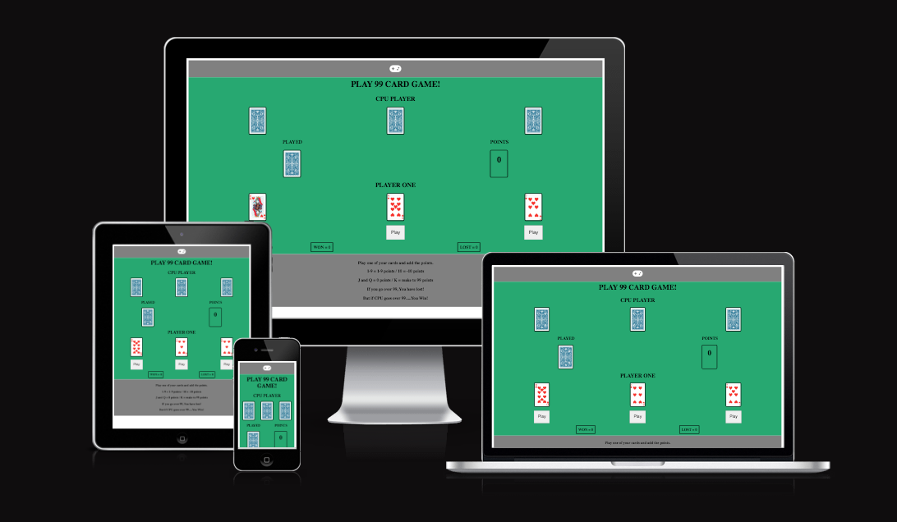
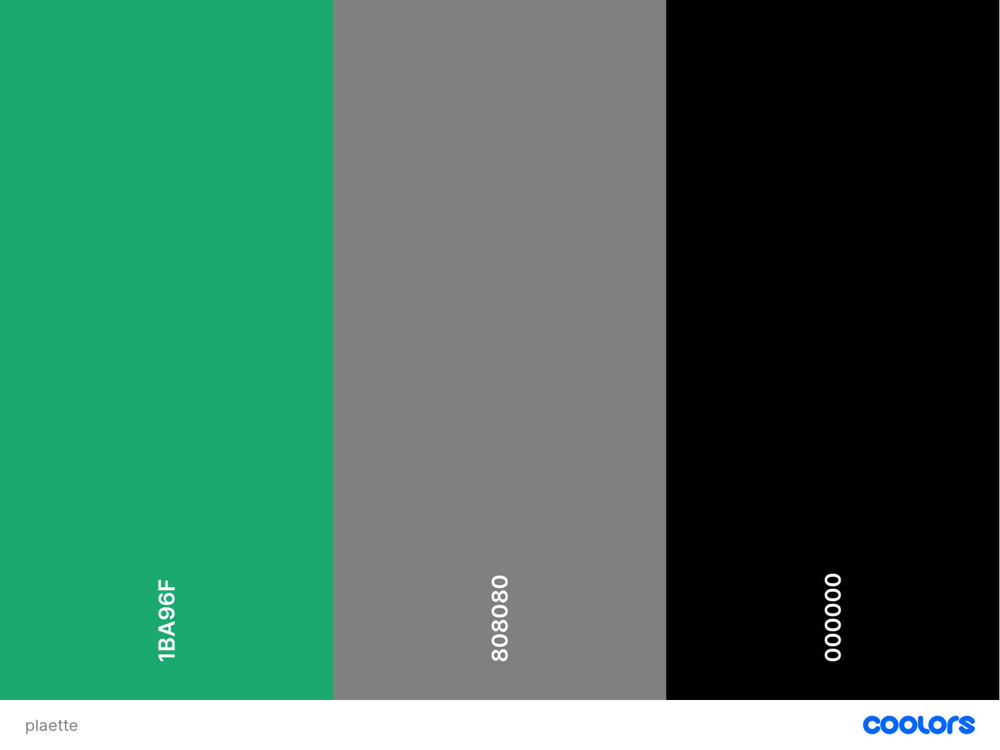
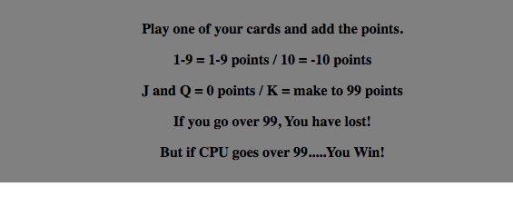
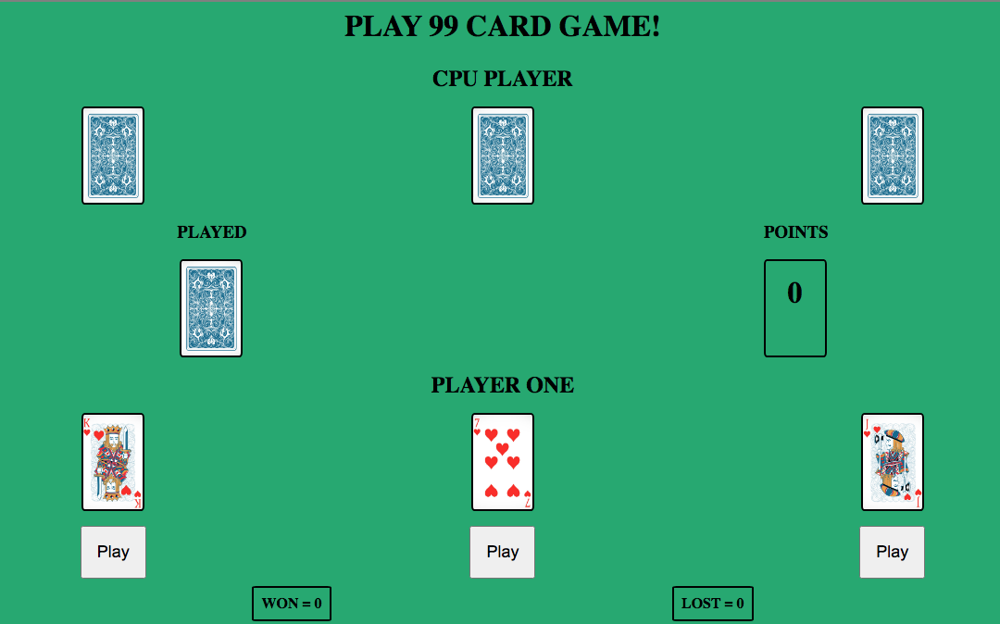
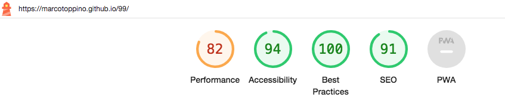
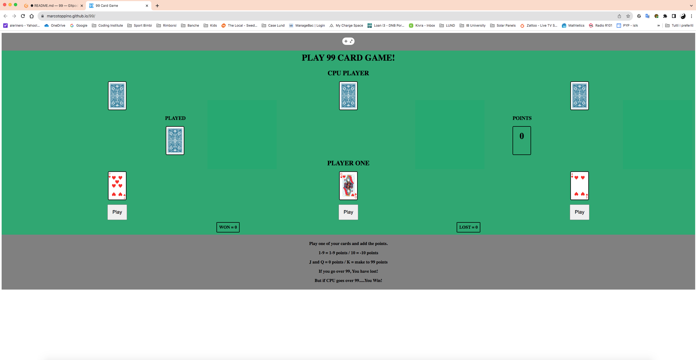
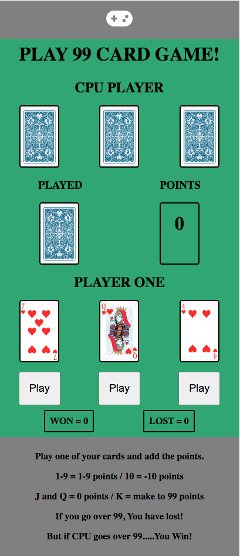
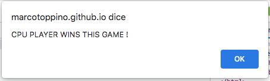
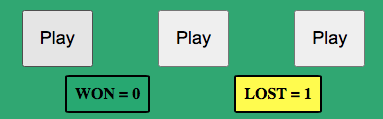

# 99 CARD GAME

99 CARD game is a kid's card game.

The objective of the game is to make the opponent go over 99 points and lose the game.

To do this the players deal one of their 3 assigned cards and add points to the already played deck, according to the game rules:

1-9 cards have 1-9 points, 10 is valued -10 (reduces the total by 10), J and Q have a zero value, while the K brings the total directly to 99.

This website was created to have fun playing this game against the computer. The game is entirely based on chance for the CPU playing strategy, while the user can choose wich card to play and therefore apply his own strategy.

The website is extremely easy to navigate as it has a single page. Rules are permanently shown to allow great playability.

A certain ability to calculate the points is required to have a good strategy, so the game can also be considered educational for kids.

Visit the deployed website [here](https://marcotoppino.github.io/99/).

## Table of Contents

1. [User Experience (UX)](#user-experience-UX)
    1. [Project Goals](#project-goals)
    2. [User Stories](#user-stories)
    3. [Color Scheme](#color-scheme)
    4. [Typography](#typography)
    5. [Wireframes](#wireframes)
2. [Features](#features)
    1. [General](#general)
    2. [Game section](#game-section)
3. [Technologies Used](#technologies-used)
    1. [Languages Used](#languages-used)
    2. [Frameworks, Libraries and Programs Used](#frameworks-libraries-and-programs-used)
4. [Testing](#testing)
    1. [Testing User Stories](#testing-user-stories)
    2. [Code Validation](#code-validation)
    3. [Accessibility](#accessibility)
    4. [Tools Testing](#tools-testing)
    5. [Manual Testing](#manual-testing)
5. [Finished Product](#finished-product)
6. [Deployment](#deployment)
    1. [GitHub Pages](#github-pages)
7. [Credits](#credits)
    1. [Content](#content)
    2. [Media](#media)
    3. [Code](#code)
8. [Acknowledgements](#acknowledgements)

***

## User Experience (UX)

### Project Goals

* The website provides a structure that is easy to understand and navigate.

* Contains easy to recognize colors and cards.

* Responsive design to make the game accessible on different devices.

* Incorporates a rules section that is easily accessible to the player.

### User Stories

* As a player, I want the game's website to be easy to navigate.

* As a player, I want the game to be fun and engaging.

* As a player, I want to have easy access to the game rules.

* As a player, I want the game controls to be easy to access during the game.

* As a player, I want to receive overall feedback during the game.

* As a player, I want to be able to play the game on different devices.

### Color Scheme

The colors used in the site are gray (#808080) for the navigation bar and the footer, green (#1BA96F) for the background, black (#000000) for the text and the hover effect of the menu, Yellow for the highlight of the win/loose boxes.

The colors scheme is a reminder of the old Solitaire game offered by Windows in the 90's.

### Typography

The main font used in the site is Cewy, part of Google Fonts.

### Wireframes

No specific software has been used to wireframe the website. The page is extemely simple and has only only sketched on paper.

[Back to top ⇧](#99-card-game)

## Features

### General

* The website has been designed from a mobile first perspective.

* Responsive design across all device sizes.

* **Header**

 - The header contains a single icon positioned on top of the main content.

- The icon allows to easily restart the game. It also has a hover effect that changes color to provide feedback to the player for a better user experience.

* **Footer**

- The footer includes the rules of the game.

### Game section

* **CPU Player Area**
    - Shows the back of the three cards assigned to the CPU.

* **Played Area**
    - Displays the last Card played by the CPU or PLAYER ONE.

* **Points Area**
    - Shows the total points before the next move.

* **Player One Area**
    - Shows the three cards available for the player.

* **Play Buttons**
    - Deals the corresponding card, chosen by the player.

* **Results Area**
    - Shows the total of games won and lost by the player. The last game result is highlighted in Yellow

## Technologies Used

### Languages Used
* [HTML5](https://en.wikipedia.org/wiki/HTML5)
* [CSS3](https://en.wikipedia.org/wiki/CSS)
* [Javascript](https://en.wikipedia.org/wiki/JavaScript)

### Frameworks, Libraries and Programs Used

* [Google Fonts](https://fonts.google.com/)
    - Google Fonts was used to import the font Cewy into the style.css file. This font was used throughout the site.

* [Font Awesome](https://fontawesome.com/)
     - Font Awesome was used to add icons to create a better visual experience for UX purposes.

* [GitPod](https://gitpod.io/)
     - GitPod was used for writing code, committing, and then pushing to GitHub.

* [GitHub](https://github.com/)
     - GitHub was used to store the project after pushing.

* [Am I Responsive?](http://ami.responsivedesign.is/#)
    - Am I Responsive was used to see responsive design throughout the process and to generate mockup imagery to be used.

* [Responsive Design Checker](https://www.responsivedesignchecker.com/)
    - Responsive Design Checker was used in the testing process to check responsiveness on various devices.

* [Chrome DevTools](https://developer.chrome.com/docs/devtools/)
    - Chrome DevTools was used during the development process for code review and to test responsiveness.

* [W3C Markup Validator](https://validator.w3.org/)
    - W3C Markup Validator was used to validate the HTML code.

* [W3C CSS Validator](https://jigsaw.w3.org/css-validator/)
    - W3C CSS Validator was used to validate the CSS code.

* [JSHint](https://jshint.com/) 
    - The JSHints JavaScript Code Quality Tool was used to validate the site's JavaScript code.

* [Favicon.cc](https://www.favicon.cc/) 
    - Favicon.cc was used to create the site favicon.

[Back to top ⇧](#99-card-game)

## Testing

### Testing User Stories

* As a player, I want the game's website to be easy to navigate.

    - THe game runs on a single page, no need at all to navigate.

    - The only link provided reloads the page to allow restarting completely the game.

* As a player, I want the game to be fun and engaging.

    - The game is simple but engaging. It empowers the player and needs some calculation abilities to develop a good strategy against the CPU.

    - The CPU Player never has a fixed strategy, allowing many different lengths of the game.
    
    - Feedback is given immediately after the move, changing the points accordingly, and drawing new cards.

* As a player, I want to have easy access to the game rules.

    - Rules are provided directly in the footer of the page, allowing immediate reference

* As a player, I want the game controls to be easy to access during the game.

    - The game contains only three buttons, directly under the cards to be played.

* As a player, I want to receive overall feedback during the game.

    - Score for the current round is always visible in the Points section.

    - A clear game result gets displayed at the end of each round (Alert) and the relevant counter is highlighted in Yellow.

    - The counters for both won and lost games are always visible and updated after every round.

* As a player, I want to be able to play the game on different devices.

    - Responsive design across all device sizes.

    ### Code Validation

* The [W3C Markup Validator](https://validator.w3.org/) and [W3C CSS Validator](https://jigsaw.w3.org/css-validator/) services were used to validate all pages of the project to ensure there were no syntax errors.

    - W3C Markup Validator returned no warnings or errors.

    - W3C CSS Validator found no errors or warnings on my CSS.

* The [JSHints JavaScript Code Quality Tool](https://jshint.com/) was used to validate the site's JavaScript code.

    - JSHints found no errors on the site's JavaScript code.

### Accessibility

* Used Lighthouse in Chrome DevTools to confirm that the colors and fonts being used throughout the website are easy to read and accessible.

* Lighthouse reports

    - **index.html**

    

### Tools Testing

* [Chrome DevTools](https://developer.chrome.com/docs/devtools/)

    - Chrome DevTools was used during the development process to test, explore and modify HTML elements and CSS styles used in the project.

* Responsiveness

    - [Am I Responsive?](http://ami.responsivedesign.is/#) was used to check responsiveness of the site pages across different devices.

    - [Responsive Design Checker](https://www.responsivedesignchecker.com/) was used to check responsiveness of the site pages on different screen sizes.

    - Chrome DevTools was used to test responsiveness in different screen sizes during the development process.

### Manual Testing

* Browser Compatibility

Browser | Outcome | Pass/Fail  
--- | --- | ---
Google Chrome | No appearance, responsiveness nor functionality issues. | Pass
Safari | No appearance, responsiveness nor functionality issues. | Pass
Microsoft Edge | No appearance, responsiveness nor functionality issues. | Pass

* Device compatibility

Device | Outcome | Pass/Fail
--- | --- | ---
iMac 27" | No appearance, responsiveness nor functionality issues. | Pass
Chromebook 15" | No appearance, responsiveness nor functionality issues. | Pass
Lenovo Tab 9" | No appearance, responsiveness nor functionality issues. | Pass
Samsung Note 9 | No appearance, responsiveness nor functionality issues. | Pass

* Common Elements Testing

    - General

    Feature | Outcome | Pass/Fail
    --- | --- | ---
    Navigation Bar | Hover effect and link are working as expected. | Pass

    - Game Section

    Feature | Outcome | Pass/Fail
    --- | --- | ---
    Player Score - Win | Increase by 1 when player win round and is highlighted. |  Pass
    Player Score - Lose | Increase by 1 when computer win round and is highlighted. |  Pass
    Played Card | Changes when Player/CPU plays a card. | Pass
    Points Section | Points from the played card are added according to the provided rules. | Pass
    Game Buttons | Clicking on each button plays the correct card. | Pass
    Rules Button | Hover effect work as expected and open rules popup when clicked. | Pass
    Rules' Close Button | Hover effect work as expected and close popup when clicked. | Pass

[Back to top ⇧](#99-card-game)

## Finished Product

Page / Section | Image
--- | ---
Desktop Version | 
Mobile Version | 
Feedback Popup | 
Result Sections | 

[Back to top ⇧](#99-card-game)

## Deployment

* This website was developed using [GitPod](https://www.gitpod.io/), which was then committed and pushed to GitHub using the GitPod terminal.

### GitHub Pages

* Here are the steps to deploy this website to GitHub Pages from its GitHub repository:

    1. Log in to GitHub and locate the [GitHub Repository](https://github.com/).

    2. At the top of the Repository, locate the Settings button on the menu.

    3. Scroll down the Settings page until you locate the Pages section.

    4. Under Source, click the dropdown called None and select Master Branch.

    5. The page will refresh automatically and generate a link to your website.

[Back to top ⇧](#99-card-game)

## Credits

### Content

* The instructions and rules were shared by mi son Pietro and his friend.

### Media

* The card images were downladed from [Freepik](https://www.freepik.com/free-vector/poker-cards-set-club-with-back-design_1169226.htm#query=poker&position=2&from_view=author&uuid=8c210342-bf87-45d9-8532-7f21ecac470e) and were designed by [brgfx](https://www.freepik.com/author/brgfx).

### Code

* [Stack Overflow](https://stackoverflow.com/), [Code Institute](https://codeinstitute.net/) and [W3Schools](https://www.w3schools.com/) were consulted on a regular basis for inspiration and sometimes to be able to better understand the code being implement.

* The code for the top navigator bar is a modified version of the W3Schools code found [here](https://www.w3schools.com/howto/howto_css_icon_bar.asp).

* The code to apply the event listeners to the buttons is a modified version of the Codeinstitute Love Maths Walkthrough Project.

[Back to top ⇧](#99-card-game)

## Acknowledgements

* My partner, for her incredible patience while I was programming during very late nights...

* My son Pietro, for the whole idea of the game and the detailed rules.

* My tutor, Marcel, for his invaluable feedback and guidance.

* Code Institute and its amazing Slack community for their support and providing me with the necessary knowledge to complete this project.

[Back to top ⇧](#99-card-game)